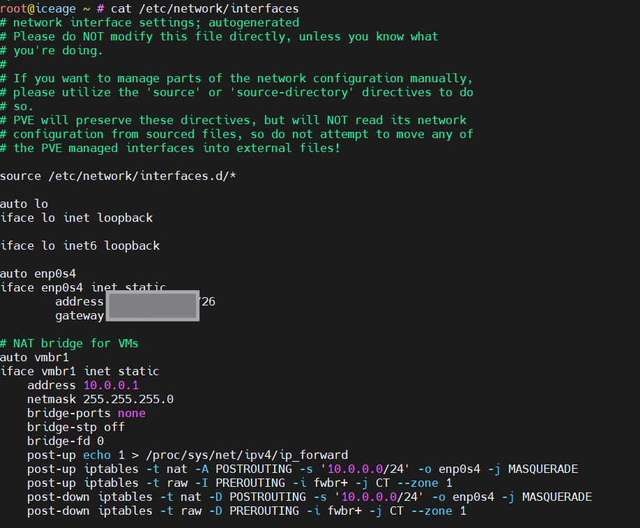

# Install Proxmox
Install proxmox in Hetzener Server with a subnet for your VM’s and set Server Security.

### Preparing the server
1. Once you have access to your Hetzner server, you need to activate the rescue system, to do this visit https://robot.hetzner.com/server and then select your server and activate rescue mode.
2. Reset the server, to do this select Reset and then Execute an automatic hardware reset .
3. ssh with root and password you have get 

### Install Proxmox
Install the iso image by run 
```
installimage 
```
then you choose the iso and that will open configuration file .
#### Acquire Configuration.
- make RAID value is 0 
- add hostname 
- make disk partion 
save to excute the file to install proxmox with its configuration,Once installation is complete, do not press Reboot, instead go back to the SSH terminal.

#### Network Configuration
You should add NAT bridge  `vmbr1` and choose your private subnet, after that create routing table. 


Now host can reach internet!

### Create VMs
> if you want to create VMs its ip should be in  range you specified in host.


